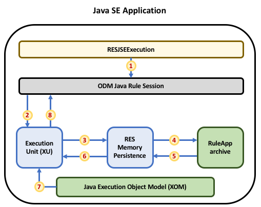

# Execute an IBM ODM Decision Service bundled into your JSE application 

[](https://travis-ci.org/ODMDev/decisions-ruleapp-embedded)
[](https://opensource.org/licenses/Apache-2.0)

This Java SE sample illustrates how to execute a decision service _bundled in your JSE application_ with IBM Operational Decision Manager. 

It makes use of:
 * ODM [Rule sessions JSE API](https://www.ibm.com/support/knowledgecenter/en/SSQP76_8.9.2/com.ibm.odm.dserver.rules.res.developing/topics/con_res_devclient_rule_sessions.html)
 * The [Java SE memory persistence](https://www.ibm.com/support/knowledgecenter/en/SSQP76_8.9.2/com.ibm.odm.dserver.rules.res.managing/topics/con_res_mem_persistence.html) introduced in *ODM 8.9.2*.

The sample architecture and workflow are as follows:



 1. The ODM Java Rule session API is invoked to execute the ruleset whose ruleset path is passed as argument (i.e. `/test_deployment/loan_validation_with_score_and_grade`). 
 1. The Rule Session API delegates the ruleset execution to the RES Execution Unit (XU).
 1. The XU fetches the ruleset from the RES memory persistence.
 1. As there is no such ruleset, the RES memory persistence looks up a matching RuleApp packaged in the application's classloader resources.
 1. The RES memory persistence loads the content of the RuleApp archive _test-deployment.jar_. 
 1. The RES memory persistence returns the target ruleset to the XU. 
 1. The XU retrieves the Java Execution Object Model (XOM) from the application classloader.
 1. The XU finally executes the ruleset and passes the available output results to the Rule Session API.
 
## Pre-requisites

You'll need [IBM Operational Decision Manager, version **8.9.2**](https://www.ibm.com/support/knowledgecenter/en/SSQP76_8.9.2/com.ibm.odm.distrib/kc_welcome_odm_distrib.html) or higher.


### Defining the ODM 8.9.2 installation directory  
To build and run this sample you'll need to set the `ibm.odm.install.dir` maven property so that it points to the actual location where ODM 8.9.2 is installed.


## Building
To build the source code, type the maven command:
```
mvn clean install -Dibm.odm.install.dir="<ODM_INSTALL_DIR>"
```

## Running
To run the sample, type the following maven command:
```
mvn exec:java -Dexec.mainClass="j2serulesession.Sample" -Dexec.args="/test_deployment/loan_validation_with_score_and_grade" -Dexec.classpathScope="test" -Dibm.odm.install.dir="<ODM_INSTALL_DIR>"
```

## License
[Apache 2.0](LICENSE)

## Notice
© Copyright IBM Corporation 2018.

[](https://travis-ci.org/ODMDev/decisions-ruleapp-embedded)
[](https://opensource.org/licenses/Apache-2.0)
